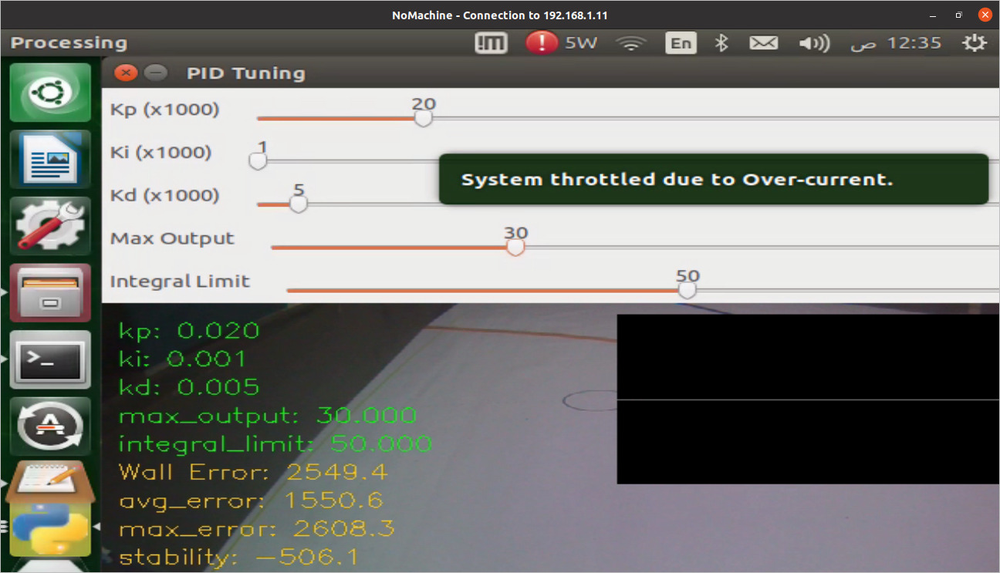
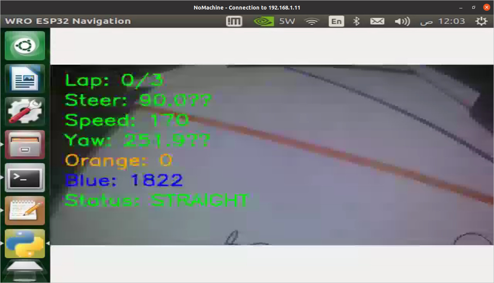

# WRO_autonomous-robot-esp32

A fully embedded autonomous robot built for the WRO competition without using ROS.

This robot uses:
- ESP32 for main control
- Ultrasonic sensors for obstacle avoidance
- BNO055 IMU for orientation
- Servo motor for Ackermann steering control
- Wide-angle camera for vision tasks (via Jetson Nano or external processor)
- Voice command input (planned for later phase)

##  Media Showcase

<p align="center">
  
</p>
<p align="center">
  
</p>
<p align="center">
  
</p>
<p align="center">
  
</p>

**Robot in Action (GIF):**
<p align="center">
  
</p>
<p align="center">
  
</p>

### 🎥 Full Video and demo
👉 [Watch the full demo video](media/videos/1.mp4)
👉 [Watch the full demo video](media/videos/2.mp4)


## 📁 Project Structure

```
WRO_autonomous-robot-esp32/
├── hardware/
│   ├── wiring_diagrams/
│   └── components_list.md
├── code/
│   ├── imu_test/
│   ├── ultrasonic_test/
│   ├── servo_control/
│   ├── main_integration/
│   └── voice_commands/
├── docs/
│   ├── logic_flowchart.png
│   └── system_architecture.pdf
├── media/
│   ├── photos/
│   └── videos/
└── LICENSE
```

## ✅ Goal

To develop a simple, cost-effective, modular autonomous robot for real-world tasks like:
- Line following
- Obstacle detection
- Basic object tracking
- Responding to voice commands (bonus)

## 🛠 Technologies

- ESP32 (Arduino framework)
- C++ / Arduino Code
- BNO055, HC-SR04, Servo motors
- Camera (via Jetson Nano)
- Voice Recognition (future extension)
